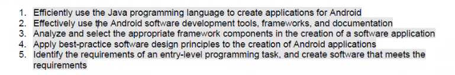
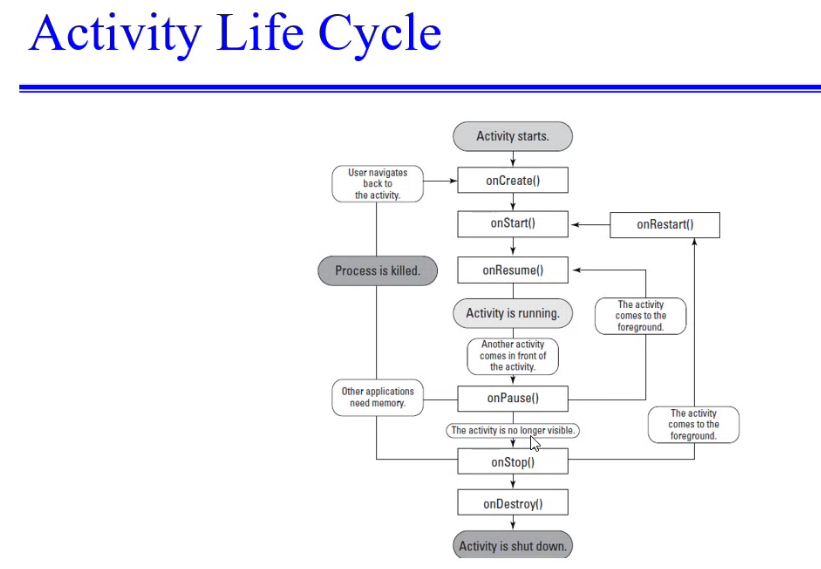

# Android Dev

#### Learning Outcomes 

### OnCreate()

- xml on the frontend and java on the backend
- when application launches onCreate() is triggered and it's the Parent Class of the activity. This method creates this activity
- OnCreate() connects your file to the backend when it's launched
- Anything that you want to do at launch can be done in the onCreate method
- OnStart() checks for housekeeping things like configuration

### onResume
- when your activity is ready to interact with the user that is when onResume is called

### onPause()
- called when a notification is up and you got to minimize. You can still see the application in the background
- OnStop is if you open a window and the user can't see the application at all
- After onStop when the activity is started again you use onRestart() like recreate objects and resources
- configurations like checking if memory, if internet is connected are rechecked as it goes to onStart()
- the heavy applications resources are used in onCreate
- onDestroy is called when you close the application completely